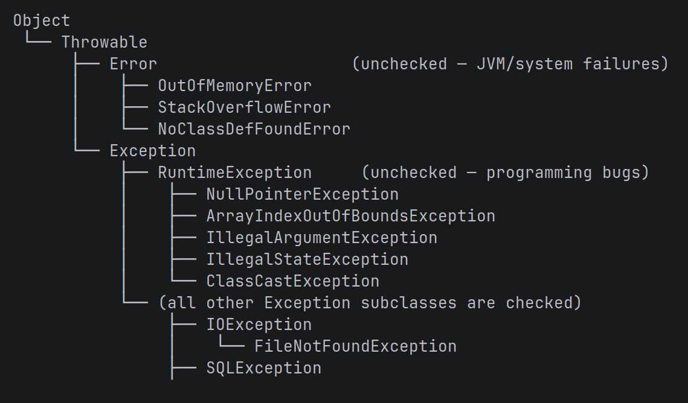

# learn-java

This project is to learn java from basic to advance level. Anyone can use it as a guide to learn java practically.

List of things that will be covered

## 1. Fundamentals of java

### chapter1_basics/
- Variables x
- DataTypes x
- Operators x
- TypeCasting x
- NamingConventions x
- MainMethod x
- Vars x
- Wrapper Classes x
- AutoboxingUnboxing x 

####  java.lang_auto_imported_classes
String x
Object x
Math x
System
Integer x
Long x
Double x
Boolean x
Character x
Float x
Byte x
Short x
StringBuilder x
StringBuffer x
Thread
Runnable
Exception
RuntimeException
Error
BuiltInClass
ClassLoader
Number
Enum x
Record x

### chapter2_control_flow/
- ConditionalStatements x
- TernaryOperator x
- Loops x
- InstanceOf x

### arrays/
- OneDimensionalArray x
- TwoDimensionalArray x
- JavaArraysClass x

### chapter4_strings/
- StringInJava x
- StringBuilder x
- StringBuffer x 
- RegularExpression x

### chapter5_methods/
- Methods x 
- Recursion x
- VarArgs x
- DefaultMethods x
- StaticMethods x

### chapter6_input_output/
- ScannerClass x
- InputOutput x
- PrintFormatting x
- DateTimeAPI x

### chapter7_utility_classes/
- Maths x
- Randoms x

### chapter8_typeof_classes/
- Build In Object BuiltInClass x
- Normal Classes x
- Abstract x
- Interfaces x
- Enums x
- Nested x
- Anonymous x
- Record x

### chapter9_collections_and_java_useful_classes/
- BuiltInClass x
- ClassLoader x
- Collections x
- Iterators x
- Object x
- Objects x
- Streams x

### chapter10_object_behavior
- EqualsHashCode x
- NullPointer x
- Cloning x
- Immutability x

### chapter11_oop_principles/
- Encapsulation x
- inheritance x
- Polymorphism x
- Abstraction x
- AccessModifiers, StaticKeyword, FinalKeyword, SuperKeyword, OverloadingOverriding x

### chapter12_exceptions/
Must-know (daily use)
1. TryCatchFinally x
2. CheckedVsUnchecked x
3. ThrowVsThrows x
4. CommonRuntimeExceptions x
5. TryWithResources x
6. ThrowableHierarchy

7. CommonCheckedCompileTimeExceptions x
8. ExceptionPropagation
When exception is not handled, exception are propagated upward (spread upward). So if we have three methods calling each other.
For example, void a(){},  void b(){a()}, void c(){b()} here if c does not handle exception, jvm looks for exception in b, if not in 
b, it looks in a, if not in a, looks for the main function. If main does not handle the exception either, program reaches the JVM default
exceptions and through unchecked(Runtime) exception. 

Important (frequent)
9. CustomCheckedException x
10. CustomUncheckedException x
11. MultiCatch x
12. RethrowAndWrap x
13. ExceptionChaining x

Good to know (occasional)
14. FinallyPitfalls
15. ExceptionsInLambdas
16. ExceptionsInConstructors
17. ExceptionsInOverriding

Niche (rare but worth knowing)
18. ExceptionsInThreads
19. SuppressedExceptions
20. AssertionsVsExceptions

### chapter13_functional/
1. Generics       
2. Lambda          
3. Comparable
4. Comparator
5. Runnable
6. Callable
7. Predicate
8. Consumer
9. Supplier
10. Method References
11. Optional

### chapter14_file_handling/
- FileHandling
- Serialization
- NIO

### chapter16_advanced/
- Annotations
- GarbageCollection
- Multithreading
- Reflection
- Concurrency
  Threads (creating, starting, stopping)
  Runnable / Callable
  synchronized keyword
  volatile keyword
  ExecutorService / ThreadPool
  Future / CompletableFuture
  Race conditions / deadlocks
  wait() / notify()
  Lock / ReentrantLock

## 2. Data Structures
## Built-in Data Structures 
1. Array (1D / 2D) x
2. ArrayList x
3. LinkedList x
4. HashSet x
5. LinkedHashSet x
6. TreeSet x
7. HashMap x
8. LinkedHashMap x
9. TreeMap X
10. Stack x
12. ArrayDeque x
13. PriorityQueue x
14. ArrayBlockingQueue

---

## Custom Data Structures)
1. CircularQueue
2. CircularLinkedList
2. Graph
    - GraphRepresentation
    - AdjacencyList
    - AdjacencyMatrix
    - BFS
    - DFS
    - WeightedGraph
2. Binary Search Tree (BST)
3. Tree Traversals (BFS / DFS on trees)
4. Balanced Trees (AVL / Red-Black concepts)
5. N-ary Tree
6. Min Heap
7. Max Heap
8. Trie

---

## 3. Algorithms

### chapter1_searching/                                                                                                   
   
  - LinearSearch                                                                                                   
  - BinarySearch
  - BinarySearchVariants

### chapter2_sorting/

  - BubbleSort                                                                                                     
  - InsertionSort
  - MergeSort                                                                                                      
  - QuickSort

### chapter3_recursion/                                                                                                   
   
  - RecursionBasics                                                                                                
  - Subsets  
  - Permutations

### chapter4_two_pointers_sliding_window/

  - TwoPointers
  - SlidingWindowFixed
  - SlidingWindowVariable                                                                                          
  - FastSlowPointers

### chapter5_bit_manipulation/

  - BitBasics
  - XORProblems

### chapter6_tree_algorithms/
                                                                                                                        
  - TreeTraversals
  - BSTOperations

### chapter7_graph_algorithms/
                                                                                                                        
  - BFS      
  - DFS

### chapter8_dynamic_programming/

  - DPBasics
  - MemoizationVsTabulation
  - CoinChange  

## 4. Design Patterns
- MVC
- Factory
- Delegation
- Singleton
- Command

## 5. Problem-Solving Patterns

### Highest Priority
1. Array Manipulation (1, 2, 3, 4, 5)
2. String Manipulation (1, 2)
3. HashMap Manipulation
4. HashSet Manipulation
5. Two Pointers or Iterators (1, 2, 3, 4, 5)
6. Fast and Slow Pointers
7. Sliding Window
8. Binary Search
9. Modified Binary Search
10. Sorting
11. Math
12. Stack
13. Queue
14. Recursion
15. Merge Intervals
16. Tree BFS
17. Tree DFS
18. Greedy
19. Top K Elements
20. Backtracking
21. Dynamic Programming

### Lower Priority
22. Cyclic Sort
23. In-place Reversal of Linked List
24. Subsets
25. Two Heaps0
26. K-way Merge
27. Matrix
28. Topological Sort
29. Divide and Conquer
30. Shortest Path
31. Bit Manipulation

## 6. Database (SQL) with PostgreSQL

## 7. Spring Boot and Testing Project 

A Link of practical implementation of Spring Boot Will be provided Soon.
